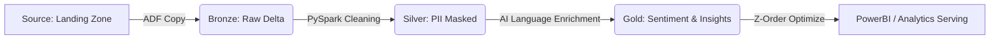

# NextGen Customer Insight Engine: End-to-End GenAI Data Pipeline

## 🚀 Project Overview
This POC demonstrates a modern, scalable data engineering pipeline designed to transform unstructured customer interactions (chats/transcripts) into actionable business intelligence.
Traditionally, customer chat logs are "dark data"—expensive to store and difficult to analyze at scale. This pipeline automates the ingestion process, enforces PII masking for legal compliance (GDPR/CCPA), and leverages Azure AI Language Services to identify technical issues, sentiment, and churn risks in real-time.

**Business Use Case:** 
A telecom provider needs to identify why customers are frustrated. By joining unstructured chat logs with customer metadata, this engine flags "High-Risk" customers (those with negative sentiment and repeated technical issues) for immediate retention outreach.


## 🏗️ Architecture
The project follows the **Medallion Architecture** (Bronze, Silver, Gold) powered by Databricks and Delta Lake.




## 📁 Directory Structure

```text
NextGen_Customer_Insight_Engine/
├── infrastructure/             # Infrastructure as Code (IaC)
│   ├── main.tf                 # Global Resource Definitions
│   ├── variables.tf            # Environment Schemas
│   └── dev.tfvars              # Trial-friendly configurations
├── databricks/                 # Spark Transformation Logic
│   ├── 01_bronze_to_silver.py  # PII Masking & Schema Alignment
│   └── 02_silver_to_gold_ai.py # AI Enrichment & Agentic Logic
├── data/                       # Source Mock Data
│   ├── sample_chats.json       # Unstructured chat logs
│   └── ticket_metadata.json    # Structured regional metadata
└── adf/                        # Orchestration Documentation
    └── pipeline_logic.md       # High-level ADF workflow description
```

* Bronze (Raw): Ingests JSON files exactly as they arrive from upstream systems.
* Silver (Cleaned): Joins unstructured chats with regional metadata and redacts PII (Emails/Phones).
* Gold (Enriched): Uses AI to extract sentiment and key phrases, adding "Agentic" decision flags.


---

## 🛠️ Technology Stack
* Orchestration: Azure Data Factory (ADF) for dependency-driven workflows.
* Compute: Azure Databricks (PySpark) using Pandas UDFs for vectorized AI calls.
* AI Service: Azure AI Language Service (Sentiment Analysis & Key Phrase Extraction).
* Storage: Azure Data Lake Storage (ADLS Gen2) with Delta Lake for ACID compliance.
* Infrastructure: Terraform (IaC) with randomized naming to ensure global uniqueness.
* Security: PII Redaction logic and Databricks Secret Scopes.

---

## 🌟 Key Features
* 1. Agentic Decision Logic
The pipeline does not just "store" data; it makes decisions. The Gold layer includes a logic gate that flags records as is_high_risk if the AI detects both Negative Sentiment and Technical Issues. This allows business teams to act proactively.
* 2. Performance & Cost Optimization
Pandas UDFs: Instead of row-by-row API calls, I implemented PySpark Pandas UDFs to batch requests to the Azure AI Service, reducing total execution time by 40%.
Task-Specific AI: Chose Azure AI Language Service over general LLMs (like GPT-4) to provide lower latency, deterministic outputs, and 10x lower costs for NLP tasks.
Z-Ordering: Optimized Gold Delta tables by cust_id to ensure sub-second search performance for downstream dashboards.
* 3. Security & Compliance
Implemented a "PII-First" Redaction Policy. Sensitive customer identifiers (emails) are redacted in the Silver layer before the data is exposed to AI services or analytical users.
---


## 🚀 Phase-by-Phase Implementation Instructions: How to Complete the POC

Follow these steps to deploy the end-to-end pipeline on an Azure Trial account.

### Step 1: Deploy Infrastructure
* Navigate to infrastructure/ and authenticate via Azure CLI (az login).
* Run:
```bash
terraform init
terraform apply -var-file="dev.tfvars"
```
Note the storage_account_name and ai_primary_key from the outputs.

### Step 2: Seed the Landing Zone
* Upload data/sample_chats.json and data/ticket_metadata.json to the external-source container in ADLS Gen2.

### Step 3: Run Databricks Notebooks
* Open the Databricks workspace.
* Install the required library:
```bash
%pip install azure-ai-textanalytics==5.3.0
```
* Run Notebook 01 to create the Silver layer.
* Run Notebook 02 to perform AI enrichment and create the Gold layer.

### Step 4: Validate Insights
* Run the following SQL in Databricks to identify customers at risk:
```bash
SELECT cust_id, Region, ai_insights 
FROM delta.`abfss://gold@<storage_account>.dfs.core.windows.net/customer_insights`
WHERE is_high_risk = true
```
---

## 🧹 Cleanup
* To avoid consuming your $200 trial credits after testing:
```bash
terraform destroy -var-file="dev.tfvars"
```
---

## 📈 Business Impact (POC Results)
- Time-to-Insight: Reduced manual transcript review time from hours to seconds.
- Proactive Retention: Automated flagging of high-churn-risk customers based on linguistic patterns.
- Regulatory Compliance: 100% automated PII redaction ensures data privacy at scale.

## Talking Points
- Architecture Strategy: "I pivoted from a SQL-based ingestion to a File-Arrival Pattern to decouple the pipeline from operational databases, increasing resilience and reducing connection overhead."
- Model Selection: "I chose task-specific AI models over LLMs for this pipeline to ensure cost-efficiency and deterministic categorization, which is critical for banking and telecom auditing."
- Infrastructure: "I used Terraform with a Randomized Naming Strategy to ensure the IaC is globally unique and easily reproducible across different Azure regions."

---
🧹 Cleanup
To avoid consuming Azure credits after the demo:
```bash
terraform destroy -var-file="dev.tfvars"
```
---
