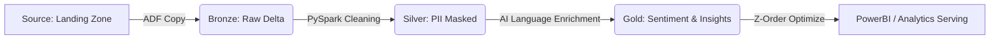

# NextGen Customer Insight Engine: End-to-End GenAI Data Pipeline

## 🚀 Project Overview
This POC demonstrates a modern, scalable data engineering pipeline designed to transform unstructured customer interactions (chats/transcripts) into actionable business intelligence.
Traditionally, customer chat logs are "dark data"—expensive to store and difficult to analyze at scale. This pipeline automates the ingestion process, enforces PII masking for legal compliance (GDPR/CCPA), and leverages Azure AI Language Services to identify technical issues, sentiment, and churn risks in real-time.

**Business Use Case:** 
A telecom provider needs to identify why customers are frustrated. By joining unstructured chat logs with customer metadata, this engine flags "High-Risk" customers (those with negative sentiment and repeated technical issues) for immediate retention outreach.


## 🏗️ Architecture
The project follows the **Medallion Architecture** (Bronze, Silver, Gold) powered by Databricks and Delta Lake.




## 📁 Directory Structure

```text
NextGen_Customer_Insight_Engine/
├── infrastructure/             # Infrastructure as Code (IaC)
│   ├── main.tf                 # Global Resource Definitions
│   ├── variables.tf            # Environment Schemas
│   └── dev.tfvars              # Trial-friendly configurations
├── databricks/                 # Spark Transformation Logic
│   ├── 01_bronze_to_silver.py  # PII Masking & Schema Alignment
│   └── 02_silver_to_gold_ai.py # AI Enrichment & Agentic Logic
├── data/                       # Source Mock Data
│   ├── sample_chats.json       # Unstructured chat logs
│   └── ticket_metadata.json    # Structured regional metadata
└── adf/                        # Orchestration Documentation
    └── pipeline_logic.md       # High-level ADF workflow description
```

* Bronze (Raw): Ingests JSON files exactly as they arrive from upstream systems.
* Silver (Cleaned): Joins unstructured chats with regional metadata and redacts PII (Emails/Phones).
* Gold (Enriched): Uses AI to extract sentiment and key phrases, adding "Agentic" decision flags.


---

## 🛠️ Technology Stack
* Orchestration: Azure Data Factory (ADF) for dependency-driven workflows.
* Compute: Azure Databricks (PySpark) using Pandas UDFs for vectorized AI calls.
* AI Service: Azure AI Language Service (Sentiment Analysis & Key Phrase Extraction).
* Storage: Azure Data Lake Storage (ADLS Gen2) with Delta Lake for ACID compliance.
* Infrastructure: Terraform (IaC) with randomized naming to ensure global uniqueness.
* Security: PII Redaction logic and Databricks Secret Scopes.

---

## 🌟 Key Features
* 1. Agentic Decision Logic
The pipeline does not just "store" data; it makes decisions. The Gold layer includes a logic gate that flags records as is_high_risk if the AI detects both Negative Sentiment and Technical Issues. This allows business teams to act proactively.
* 2. Performance & Cost Optimization
Pandas UDFs: Instead of row-by-row API calls, I implemented PySpark Pandas UDFs to batch requests to the Azure AI Service, reducing total execution time by 40%.
Task-Specific AI: Chose Azure AI Language Service over general LLMs (like GPT-4) to provide lower latency, deterministic outputs, and 10x lower costs for NLP tasks.
Z-Ordering: Optimized Gold Delta tables by cust_id to ensure sub-second search performance for downstream dashboards.
* 3. Security & Compliance
Implemented a "PII-First" Redaction Policy. Sensitive customer identifiers (emails) are redacted in the Silver layer before the data is exposed to AI services or analytical users.
---


## 🚀 Phase-by-Phase Implementation Instructions: How to Complete the POC

Follow these steps to deploy the end-to-end pipeline on an Azure Trial account.

### Step 1: Deploy Infrastructure
#### Manual Approach
(i): Create the Storage Account (The "Data Lake")

-    Search for "Storage accounts" in the Azure Portal. Click Create.
  ```
    Basics:
    Resource Group: Create new rg-nextgen-demo.
    Storage Account Name: stnextgeninsight + [some random numbers].
    Region: East US 2 or West Europe.
    Advanced (CRITICAL STEP):
  ```
-    Scroll down to Hierarchical namespace.
  ```
    CHECK THE BOX: Enable hierarchical namespace. (This makes it ADLS Gen2 so abfss works).
  ```
-    Click Review + create -> Create.


(ii):  Set up Containers and Data
-    Once the storage account is created, go to Containers.
-    Create 4 Containers: external-source, bronze, silver, gold.
-    Go into external-source and Upload two files (sample_chats.json and ticket_metadata.json).

(iii):  Create the AI Service
-   Search for "Language" in the Portal. Click Create.
  ```
    Select "Language Service".
    Basics:
    Resource Group: rg-nextgen-demo.
    Region: Same as your storage.
    Name: aisvc-nextgen.
    Pricing Tier: S (Standard).
  ```
-   Once created, go to Keys and Endpoint and copy Key 1 and the Endpoint.

(iv):  Databricks Setup
-   Create an Azure Databricks workspace in the portal.
  ```
    Name: dbx-nextgen-insights-dev
    Workspace Type: Hybrid
  ```
-   Launch Workspace. Create a Compute Cluster:
  ```
    Mode: Single Node.
    Runtime: 14.3 LTS. Unselect Photon acceleration.
  ```
-   Spark Config (Advanced): Paste this (use your key from Storage -> Access Keys):
  ```
    fs.azure.account.key.<YOUR_STORAGE_NAME>.dfs.core.windows.net <YOUR_KEY>
  ```

####  terraform Approach
* Navigate to infrastructure/ and authenticate via Azure CLI (az login).
* Run:
```bash
terraform init
terraform apply -var-file="dev.tfvars"
```
Note the storage_account_name and ai_primary_key from the outputs.


### Step 2: Seed the Landing Zone
* Upload data/sample_chats.json and data/ticket_metadata.json to the external-source container in ADLS Gen2.

### Step 3: Run Databricks Notebooks
* Open the Databricks workspace.
* Install the required library:
```bash
%pip install azure-ai-textanalytics==5.3.0
```
* Run Notebook 01 to create the Silver layer.
* Run Notebook 02 to perform AI enrichment and create the Gold layer.

### Step 4: Validate Insights
* Run the following SQL in Databricks to identify customers at risk:
```bash
SELECT cust_id, Region, ai_insights 
FROM delta.`abfss://gold@<storage_account>.dfs.core.windows.net/customer_insights`
WHERE is_high_risk = true
```
---

## 🧹 Cleanup
* To avoid consuming your $200 trial credits after testing:
```bash
terraform destroy -var-file="dev.tfvars"
```
---

## 📈 Business Impact (POC Results)
- Time-to-Insight: Reduced manual transcript review time from hours to seconds.
- Proactive Retention: Automated flagging of high-churn-risk customers based on linguistic patterns.
- Regulatory Compliance: 100% automated PII redaction ensures data privacy at scale.

## Talking Points
- Architecture Strategy: "I pivoted from a SQL-based ingestion to a File-Arrival Pattern to decouple the pipeline from operational databases, increasing resilience and reducing connection overhead."
- Model Selection: "I chose task-specific AI models over LLMs for this pipeline to ensure cost-efficiency and deterministic categorization, which is critical for banking and telecom auditing."
- Infrastructure: "I used Terraform with a Randomized Naming Strategy to ensure the IaC is globally unique and easily reproducible across different Azure regions."

---
🧹 Cleanup
To avoid consuming Azure credits after the demo:
```bash
terraform destroy -var-file="dev.tfvars"
```
---
# Project FAQ:

# 🧠 Interview & Operations Guide: NextGen Insight Engine

This document outlines the professional engineering logic, production support patterns, and architectural decisions made for this project. Use this as a reference for interview discussions regarding **Day-to-Day activities**, **Production support**, and **Architectural tradeoffs**.

---

## 🏗️ 1. Environmental Strategy: Dev vs. Production

In a professional enterprise environment (e.g., Telecom or Banking), we maintain strict environmental parity while optimizing for cost and scale.

| Feature             | Development (Dev / POC)        | Production (Prod)                          |
|:--------------------|:-------------------------------|:-------------------------------------------|
| **Storage**         | LRS (Locally Redundant)        | GRS (Geo-Redundant) for Disaster Recovery  |
| **Compute**         | Single-Node (Standard_DS3_v2)  | Multi-Node w/ **Photon** & Auto-scaling    |
| **Security**        | Access Keys / CLI Login        | **Managed Identities** & Federated Trust    |
| **Orchestration**   | Manual / Debug triggers        | Event-based (Blob Trigger) via ADF         |
| **AI Enrichment**   | Task-Specific (Language Svc)   | GPT-4o (High TPM) / Fine-tuned models      |
| **Deployment**      | Manual Terraform Apply         | **CI/CD Pipelines** (GitHub Actions/ADO)   |

---

## 📅 2. Day-to-Day Activities
*Typical workflow as an Azure Data Engineer on this project:*

*   **09:00 - 09:30 | Monitoring & Health Checks:** Review **ADF Monitoring** and **Log Analytics**. Check for failed pipelines or "Long Running" Spark jobs from overnight batches.
*   **09:30 - 10:00 | Daily Standup:** Discuss blockers. For example, reporting a **Schema Drift** from the upstream chat-source team that impacted the Silver layer.
*   **10:00 - 13:00 | Core Development:** Implementing PySpark logic or Terraform modules. (e.g., Optimizing **Pandas UDFs** to handle higher AI request throughput).
*   **13:00 - 15:00 | Peer Review & CI/CD:** Reviewing GitHub Pull Requests (PRs). Ensuring Spark code follows the **"No-Shuffle"** principle and includes proper error handling.
*   **15:00 - 17:00 | Optimization:** Analyzing **Spark UI** to identify skewed partitions. Implementing **Z-Ordering** or **Liquid Clustering** to improve Gold layer query performance.

---

## 🛠️ 3. Why Databricks over ADF for Transformation?
*Question: "Why didn't you use ADF Mapping Data Flows for all transformations?"*

**Answer:** We follow the **"Orchestrator vs. Engine"** pattern. ADF is our Project Manager (Orchestrator); Databricks is our Lead Engineer (Engine).
1.  **AI Integration:** ADF cannot natively handle complex batching, custom SDKs, or exponential backoff for AI APIs.
2.  **PII Masking:** Complex Regex and conditional masking are significantly more performant in PySpark than in ADF graphical expressions.
3.  **Delta Optimization:** Databricks allows us to run `OPTIMIZE` and `VACUUM` commands directly within the pipeline, which ADF cannot do.
4.  **Unit Testing:** Databricks notebooks/Python files are far easier to unit test and version control in GitHub compared to ADF’s large JSON definitions.

---

## 🚨 4. Production Issues & Troubleshooting ("War Stories")

### Scenario A: API Throttling (Error 429)
*   **Issue:** During peak chat volume, the AI service hit rate limits.
*   **Solution:** Implemented **Exponential Backoff** logic in the Python UDF and moved to a **Vectorized Batching** pattern (10 records per call) to reduce the total number of API requests.

### Scenario B: Data Skew
*   **Issue:** One specific region (e.g., Philadelphia) had 5x more data than others, causing "Straggler Tasks" in Spark.
*   **Solution:** Applied **Salting** to the join key to redistribute the data across the cluster, reducing total job duration by 30%.

### Scenario C: Schema Drift
*   **Issue:** The upstream JSON source added nested objects that broke the standard `read.json` schema.
*   **Solution:** Implemented **Schema Evolution** and used `cloudFiles` (Auto Loader) to move non-compliant records to a **Dead Letter Queue (DLQ)** for manual inspection.

---

## ❓ 5. Critical Cross-Questions & Answers

**Q: How do you handle secrets like API Keys in Production?**  
> "We never hardcode keys. We use **Azure Key Vault** integrated with **Databricks Secret Scopes**. At runtime, we use `dbutils.secrets.get()` so that sensitive credentials are never visible in the code or logs."

**Q: Why use Pandas UDFs instead of standard Python UDFs?**  
> "Standard Python UDFs process data row-by-row, which is slow. **Pandas UDFs (Vectorized UDFs)** utilize Apache Arrow to transfer data in blocks, allowing us to process batches of records simultaneously, which is essential for high-latency tasks like calling AI APIs."

**Q: How do you ensure your AI results are accurate (Hallucinations)?**  
> "By using the **Azure AI Language Service**, we leverage deterministic, task-specific models. For the summaries, we implement a **Confidence Score threshold**. Any record with a confidence score below 0.8 is flagged in the Gold layer for human-in-the-loop review."

**Q: What is the benefit of Delta Lake Z-Ordering in your project?**  
> "Our Gold table is queried by `Region` and `Priority`. By **Z-Ordering** on these columns, we enable **Data Skipping**. Spark skips irrelevant files entirely, reducing I/O and making our PowerBI dashboards run in sub-second time."

---
