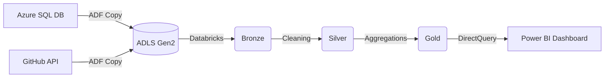

# Retail Data Pipeline: Multi-Source Ingestion to Power BI 📈

## 🚀 Project Overview
This project builds a scalable, automated data pipeline for a retail client. The goal is to centralize fragmented data from multiple sources (Azure SQL and REST APIs) into a centralized Data Lake, transform it using the Medallion Architecture, and provide executive insights through Power BI.

## 🏗️ Architecture
The architecture leverages the best-of-breed Azure services:
- **Sources:** Azure SQL DB (Transactional) & GitHub/REST API (Customer Data).
- **Orchestration:** Azure Data Factory (ADF).
- **Data Lake:** Azure Data Lake Storage Gen2 (ADLS).
- **Processing:** Azure Databricks (PySpark).
- **Serving Layer:** Delta Lake (Gold tables).
- **Visualization:** Power BI Desktop.

# End-to-End Retail Data Engineering Pipeline 🛒

## 📋 Business Requirements
The objective of this project is to build a scalable and automated data pipeline for retail clients to centralize their data and drive business intelligence.

*   **End-to-End Pipeline:** Automate the flow from raw source data to final Power BI dashboards.
*   **Multi-Source Ingestion:** Ingest data from disparate sources into a unified Azure Data Lake.
*   **Relational Data:** Handle transactional records, store information, and product metadata from **Azure SQL Database**.
*   **Semi-Structured Data:** Ingest customer demographics and behavior data via a **REST API (JSON format)**.

---

## 🏗️ Step-by-Step Implementation

### Phase 1: Environment Setup
1.  **Resource Group:** Create `rg-retail-project` to manage all cloud resources.
2.  **Storage:** Provision **Azure Data Lake Storage (ADLS Gen2)** with **Hierarchical Namespace** enabled.
3.  **Database:** Setup **Azure SQL Database** (using Serverless/Basic tier for cost optimization).
    * Database name: pocdatabase
    * Server name: pocserver999
    * Location: (US) West US 2
    * Authentication method: Use SQL authentication
    * server admin login: adminuser / India@123
    * Workload environment: Development
    * Compute + storage(Configure database): Basic
    * Backup storage redundancy: Locally-redundant backup storage

5.  **Compute:** Provision an **Azure Databricks** Premium Workspace for advanced security and Unity Catalog features.
6.  **Orchestration:** Setup **Azure Data Factory (ADF)** to manage the workflow.

### Phase 2: Source Data Preparation
1.  Execute DDL scripts in the Azure SQL Query Editor to create the `Products`, `Stores`, and `Transactions` tables.
2.  Populate the SQL tables with mock retail datasets.
3.  Validate the REST API endpoint (GitHub-hosted JSON) for customer demographic data.

### Phase 3: Ingestion (ADF)
1.  **Linked Services:** Establish secure connections to Azure SQL DB and ADLS Gen2.
2.  **Datasets:** Define Parquet datasets for the landing zone (Bronze layer).
3.  **Pipeline Orchestration:**
    *   Create **Copy Activities** to migrate SQL tables to the Data Lake.
    *   Create a **Copy Activity** for the REST API source.
    *   Sink all raw data into the `retail/bronze/` directory in **Parquet** format.

### Phase 4: Transformation (Databricks)
1.  **Mounting:** Securely mount the ADLS Gen2 container to the Databricks File System (DBFS) using `dbutils.fs.mount`.
2.  **Bronze Layer:** Read raw Parquet and JSON files into Spark DataFrames.
3.  **Silver Layer (Data Cleaning):**
    *   **Type Casting:** Convert schemas (e.g., String to Integer for IDs, String to Double for Price).
    *   **Deduplication:** Remove duplicate records from the Customer dataset.
    *   **Data Enrichment:** Join Transactions, Products, Stores, and Customers into a single flattened "Silver" DataFrame.
4.  **Gold Layer (Aggregations):**
    *   Group data by `Transaction_Date`, `Store_Name`, and `Category`.
    *   Apply business logic: `Total_Sales_Amount = Quantity * Price`.
    *   Persist the results as a **Delta Table** in the Gold container for high-performance querying.

### Phase 5: Visualization (Power BI)
1.  **Connectivity:** Connect Power BI Desktop to the Databricks SQL Warehouse or Cluster.
2.  **Data Ingestion:** Import the `gold_sales_summary` table.
3.  **Dashboard Creation:**
    *   **Card Visual:** Total Sales Amount.
    *   **Line Chart:** Monthly Sales Trends.
    *   **Pie Chart:** Sales Distribution by Store Name.
    *   **Donut Chart:** Top Selling Product Categories.

---

## 📊 Key Metrics Delivered
*   **Total Sales:** Aggregated by store location and product category.
*   **Sales Trends:** Time-series analysis showing daily and monthly performance.
*   **Average Transaction Value:** Efficiency metrics per store.
*   **Product Heatmap:** Insights into high-demand products and categories.

---
